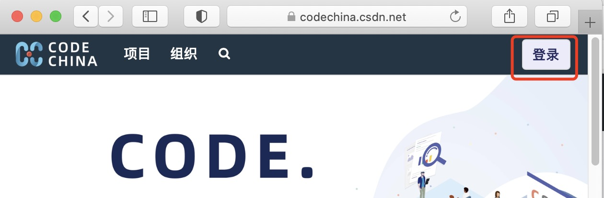
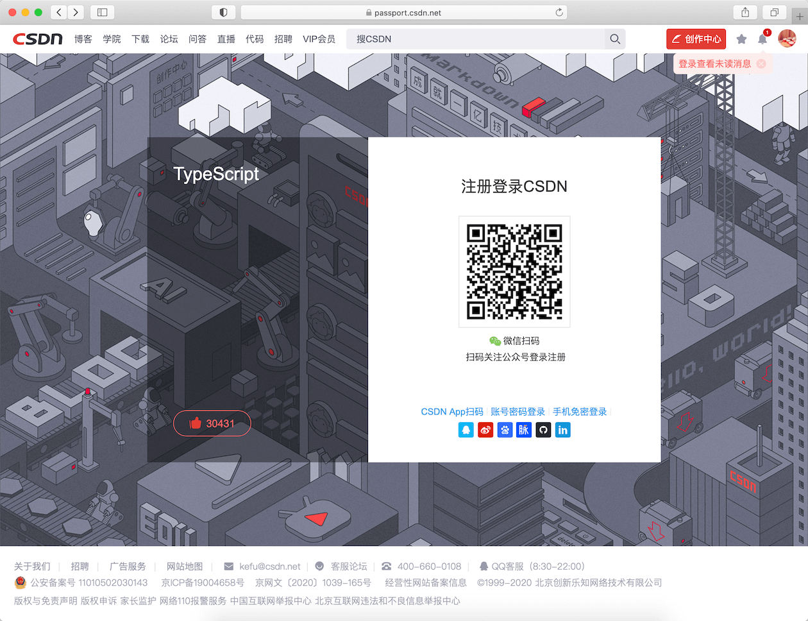
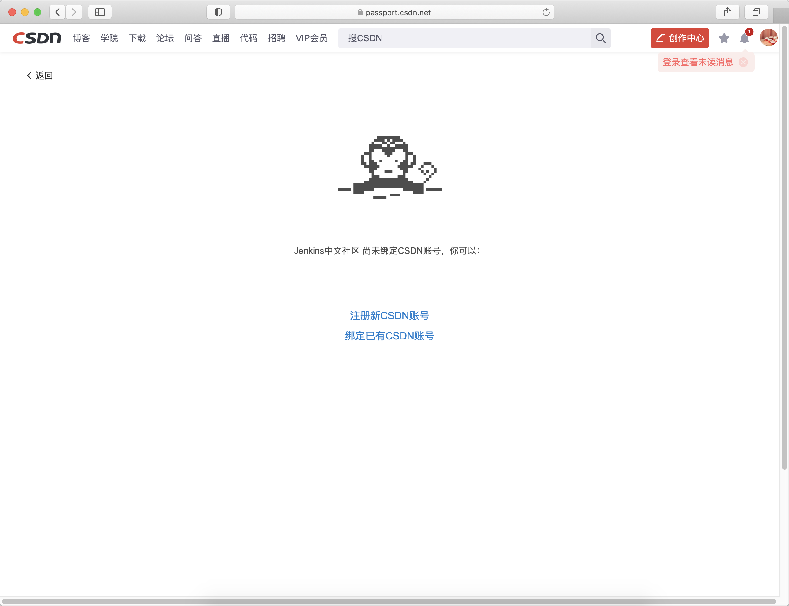
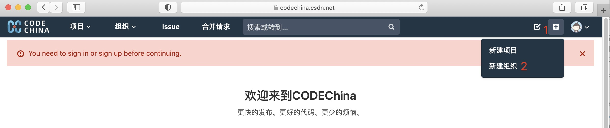
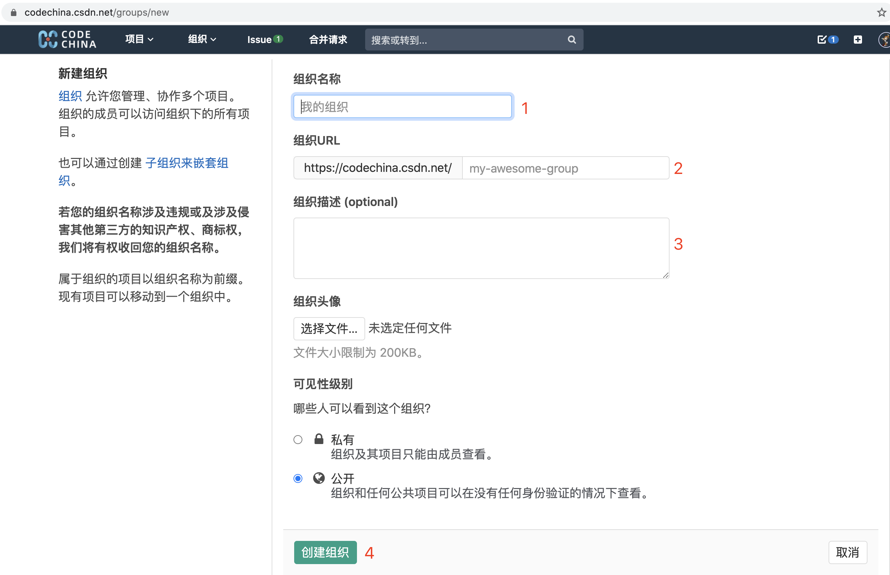
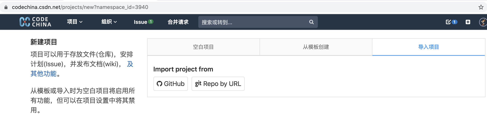

[CSDN](https://www.csdn.net/) 旗下的代码托管平台 [CodeChina](https://codechina.csdn.net/) 邀请业内知名的开源公司、开源社区入驻，我们会秉承取之开源、用于开源的原则
为每一位开源贡献者提供优质服务。

# 入驻权益
凡入驻 [CodeChina](https://codechina.csdn.net/) 的企业（社区）将会享受到下面的权益：
* 企业认证标示（内测中）
* 优先参与由 CSDN 推动的开源加速计划
* 优先进入到开源动态报告中
* 代码仓库定期同步
* 敬请期待

# 企业（社区）开源负责人可以按照下面的入驻流程来入驻：
1. 注册 CSDN 账号（需要绑定手机号）

2. 访问 https://codechina.csdn.net 并登陆，此时会跳转到 CSDN 登录页面

3. 登录成功后，会返回到 [CodeChina](https://codechina.csdn.net/) 首页
4. 在右上角点击"➕"，并选择“创建组织”，填入名称等信息即可创建

5. 导入已有项目，如下图所示，我们支持从 [GitHub](https://github.com/) 上导入，或者直接通过 git 地址来导入

# 代码仓库同步（内测中）
代码定期同步功能，可以解决直接访问 GitHub 速度非常慢的痛点。用户可以简单地通过在组织或者具体项目上设置 mirror 同步的功能，就可以方便地将代码从 GitHub 上同步到 [CodeChina](https://codechina.csdn.net/) 的效果。

注意，该功能的使用需要当入驻企业通过认证（提供企业以及运营人员相关信息）后，才能开启。

# 联系人
如果您对上述流程有任何问题，都可以通过下面的方式来联系我们：
* 邮件 zhaoxj@csdn.net
* 微信 361981269

# 当前受邀入驻的企业包括：
* [JEECG开源社区](https://codechina.csdn.net/jeecg)
* [Mozi](https://codechina.csdn.net/mozi)
* [北京旷视科技有限公司](https://codechina.csdn.net/megvii)
* [DCloud](https://codechina.csdn.net/dcloud/uni-app)
* [apache](https://codechina.csdn.net/apache/)
* 敬请期待
