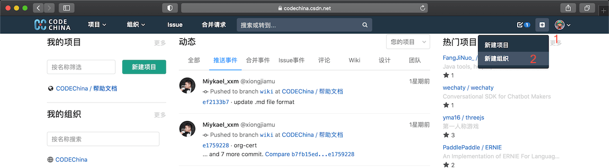
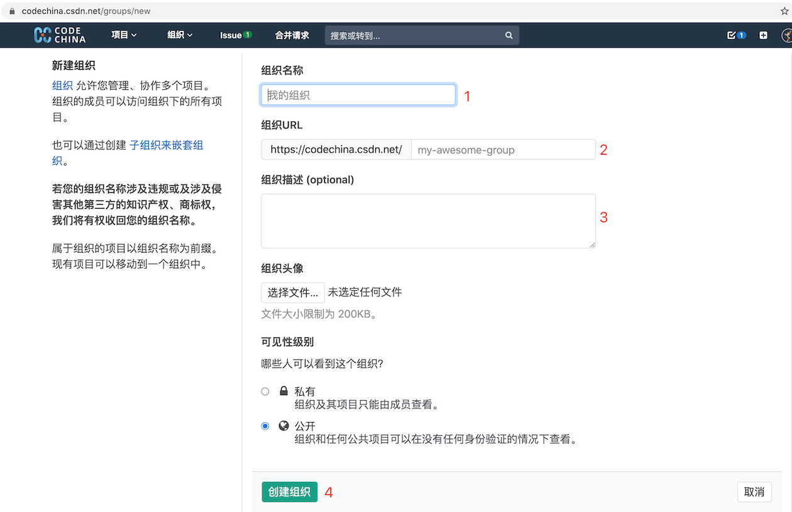

[CSDN](https://www.csdn.net/) 旗下的代码托管平台 [CodeChina](https://codechina.csdn.net/) 邀请业内知名的开源公司、开源社区入驻，我们会秉承取之开源、用于开源的原则
为每一位开源贡献者提供优质服务。

# 企业（社区）开源负责人可以按照下面的入驻流程来入驻：
1. 注册 CSDN 账号（需要绑定手机号）

2. 访问 https://codechina.csdn.net 并登陆，此时会跳转到 CSDN 登录页面

3. 登录成功后，会返回到 [CodeChina](https://codechina.csdn.net/) 首页
4. 在右上角点击"➕"，并选择“创建组织”，填入名称等信息即可创建

5. 导入已有项目，如下图所示，我们支持从 [GitHub](https://github.com/) 上导入，或者直接通过 git 地址来导入

# 当前受邀入驻的企业包括：
* [阿里巴巴](https://codechina.csdn.net/alibaba)
* 敬请期待
